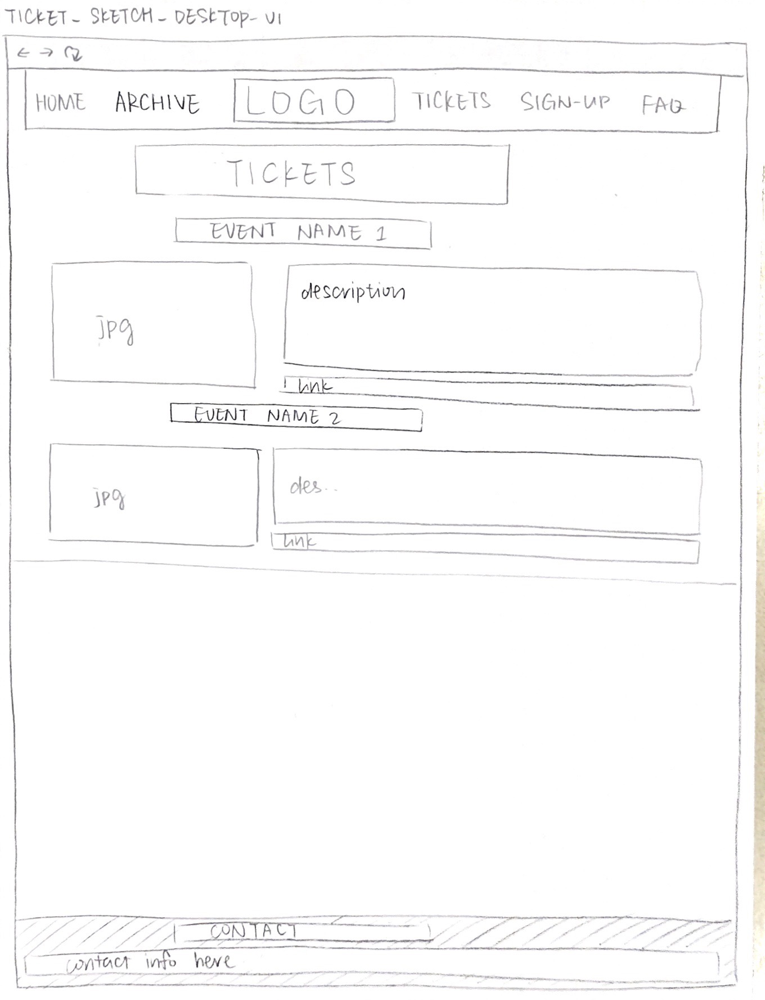

# Project 4 - Design & Plan

# Planning

## Client Description (Milestone 1)
> Tell us about your client. Who is your client? What kind of website do they want? What are their key goals?

Fanclub Collective is a club that promotes DIY, student-run concerts. They aim to diversify the music and culture scenes here at Cornell by fostering an inclusive and creative space for marginalized communities and artists. They're a not-for-profit organization with about 10 active members and several more part-time participating students who reach out to student, local, and nearby artists to organize small concerts hosted at Cornell throughout the semester.

## Site's Purpose (Milestone 1)
> Tell us the purpose of the website and what it is all about.

The site will serve as a place for bands to read up on Fanclub Collective, look at the catalog of past shows, and decide if they want to be in a show. The site is also the place where Cornell students can look up upcoming shows, find photos taken at shows and apply to be a member of Fanclub.

## Client Meeting Notes (Milestone 1)
> Include your notes/minutes from the client meeting, an email they sent you, or whatever you used to keep track of what was discussed at the meeting.


## Client Needs and Wants (Milestone 1)
> Collect your client's needs and wants for the website. Come up with several appropriate design ideas on how those needs may be met. In the **Memo** field, justify your ideas and add any additional comments you have. There is no specific number of needs required for this, but you need enough to do the job.

Needs/Wants: Way for artists to sign up
- **Needs and Wants** [What does your client need and want?]
  - Fanclub wants to make it easier for artists, bands, and labels to reach out and book a slot to perform at a show or ask for more information about the organization. Instead of simply reaching out to artists over email as they have done in the past, Fanclub members want to have an online presence that can be found by artists and a legitimate website to show artists they do reach out to who ask for more information about the organization before consenting to play a show through Fanclub Collective.
- **Design Ideas and Choices** [How will you meet those needs and wants?]
  - The website should be visually pleasing and professional-looking in order to impress potential performers and convince them to perform. There should be simple and accessible forms to sign up for performance slots.
- **Memo** [Justify your decisions; additional notes.]
  - Form, contact info

Need/Want: Archives of past shows
- **Needs and Wants** [What does your client need and want?]
  - In order to display themselves as an established organization worthy of hosting good artists, and also in order to inspire guests to attend shows, Fanclub wants to show off an archive of past shows that they've organized.
- **Design Ideas and Choices** [How will you meet those needs and wants?]
  - We'll have a page just for the archives where people can browse old shows to see the range of types of artists/bands/genres Fanclub has hosted in the past and take a look at their photos.
- **Memo** [Justify your decisions; additional notes.]
  - Spotlights for some artists who have become more famous since performing at Fanclub shows? Categories?

Need/Want: Photo Gallery of past shows
- **Needs and Wants** [What does your client need and want?]
  - In line with the archive, Fanclub wants to collect photos of past shows so potential performers can check out the popularity of the shows, the various venues at which they've been held in the past, and general ambience.
- **Design Ideas and Choices** [How will you meet those needs and wants?]
  - We'll have a slideshow of some good photos on the homepage, and include other photos on the page for the archives of old shows.
- **Memo** [Justify your decisions; additional notes.]
  - Professional website with added color from the photos, leaves the focus there.


## User(s) (Milestone 1)
> Tell us about the users (target audience) for this website.

 Users of the site with mainly be artists, bands, and labels on the east coast who Fanclub Collective wants to recruit to perform at future shows, or who have independent interest in performing at a Fanclub show or just generally in Ithaca or at Cornell. Other users in addition to the target audience might include students interested in attending the shows or in joining Fanclub Collective.

## Discovering Users' Needs (Milestone 1)
> You'll need to discover your users' needs. Talk to them! Document what you've learned about them. When talking to your users, take notes and include those notes here.


## Users' Needs (Milestone 1)
> Analyze the users' needs and wants from your notes above. List each need/want below. There is no specific number of needs required for this, but you need enough to do the job.
> **Note:** These are probably *not* the needs of your client.

Need/Want: Calendar of Past and Future Events
- **Needs and Wants** [What do the users need and want?]
  - Need to get a sense of the kinds of shows that Fanclub hosts, how busy the schedule is, how early you need to reach out to book a show, where the shows are located...
- **Design Ideas and Choices** [How will you meet those needs and wants?]
  - Have a calendar or list of future shows in addition to the archives page of past shows, with details and links to the FB event for all future shows to provide maximum info.
- **Rationale & Additional Notes** [Justify your decisions; additional notes.]
  - Calendar could be nice but overkill since shows are booked throughout the semester as well as far in advance so it would have to be frequently updated and misleading and that might be inconvenient for both Fanclub's board and artists trying to gage Fanclub's availability. The list format might be better for this.

Need/Want: Form to submit artist info to book a show
- **Needs and Wants** [What do the users need and want?]
  - Need an easy way to apply for a gig and show all of the artist's profile in the form of tracks they plan to play and social media as well as basic information about them. Also include scheduling (month or specific dates would like to perform, other availability/transportation details).
- **Design Ideas and Choices** [How will you meet those needs and wants?]
  - Include all of this in the form as well as a spot for a bio artists can submit about themselves that can be used to promote the show and contact info so that they can be contacted about scheduling and further logistics.
- **Rationale & Additional Notes** [Justify your decisions; additional notes.]
  - This info will also help Fanclub put together cohesive shows showcasing complimentary artists.

Need/Want: FAQ page
  - **Needs and Wants** [What do the users need and want?]
    - Provide answers to frequently asked questions about venues, Fanclub's history/background/funding, typical performance length, number of performers featured at each show, how to sign up for a show, how to volunteer at a show, how to join Fanclub Collective, etc.
  - **Design Ideas and Choices** [How will you meet those needs and wants?]
    - Have an entire page devoted to FAQs and maybe also include a feedback form at the bottom where people can submit further questions.
  - **Rationale & Additional Notes** [Justify your decisions; additional notes.]
    - Would be extremely useful in minimizing the amount of back and forth emailing between Fanclub and artists that goes into planning shows and their logistics (such as transportation, pay, housing, etc.).

Need/Want: Fanclub Contact Information

  - **Needs and Wants** [What do the users need and want?]
      - Direct contact information of Fanclub board members and descriptions of their positions and responsibilities/knowledge areas.
  - **Design Ideas and Choices** [How will you meet those needs and wants?]
      - Put the contact info in several places on the site, specifically near the form where artists sign up, also on the home page.
  - **Rationale & Additional Notes** [Justify your decisions; additional notes.]
      - Artists might have specific questions about equipment or something along those lines that's not answered in the FAQ that they would like to address to the specific person in charge of handling those things without having to go through several people in order to get the information they need.


## User Testing Plan (Milestone 1)
> Plan out your tasks for evaluating whether your site will meet the needs of the users. These must be actual user testing tasks. Tasks are not questions!

1.  You are an artist who would like to play at a future Fanclub show. Share your contact information and any other relevant info with Fanclub Collective.

2. Your friend wants to know if they can join Fanclub Collective. Determine how they would go about this.

3. Find an artist that has performed at Fanclub Collective before who you would like to see perform again.

4. You run a concert venue in Ithaca. Contact Fanclub Collective offering it as a concert location.


## Content (Milestone 1)
> Plan out your site's content (text, images, etc.). Make a list of **all** the content you will need. This list should be **exhaustive**.

- slideshow of images + descriptions
- form to sign up for a show as a performer
- link to ticket sales
- link to each event's facebook page
- information (Calendar or List) for upcoming events
- navigation bar
- bulletin announcements
- Fanclub logo
- executive board photos and info
- description of past events (with images)
- contact info of Fanclub Collective
- Question and answers (FAQ)
- Feedback form
- archive & photos of past events
- info about renting out concert space (Cayuga Lodge basement)
- blurb about Fanclub Collective's mission, activities, and history
- form to join Fanclub collective
- nav bar for sorting/searching events in different ways
- general nav bar
- description of future events
- photos of the posters for them if created
- links to FB pages for the events
- photos and descriptions of FC e-board members and their positions


## Interactivity Ideas (Milestone 1)
> Come up with some idea for interactive features for your site.

- slideshow of best photos
- gig sign up for bands
- "bulletin" announcements/commentary
- photo gallery
- form for bands/labels
- form for students interested in joining Fanclub
- form switches between bands or students
- calendar
- search/sort in archives

# Design & Evaluation

## Design Process (Milestone 1)
> Document your design process. Show us your card sorting. Design your navigation from the card sorting. Outline your navigation. Describe your theme. Show us sketches of your site (mobile and desktop versions). etc.

For the card sorting, we took all the contents that the client requested as well as all the content that the target audience might need added with additional design choices we made and listed them all. Afterwards, we grouped them in different logical groupings which eventually gave us an idea of how content on the website should be organized (different pages...)

Card sorting version 1:

For the first cardsort, we took all of the ideas we'd brainstormed after meeting with our client and put the pieces together in an order that made sense category-wise.

Card sorting version 2:

Next, we passed the cardsort along to a different team member, who reorganized the placement of some of the content in a manner that made sense to her.

Card sorting version 3:

Finally, we compared the two versions and came up with a final draft that we thought would be most intuitive to users based on the instincts of our team members and the amount of space each element of content would likely take up on each of the webpages. We later decided to add in another page just for signup forms in order to highlight that feature of the website, since the main purpose of the site is to recruit performers.


> You should show us how your came up with your design and how you iterated on that design; show us the evolution of your design.

Homepage design version 1


Since our client wants a minimalistic theme, we designed the homepage with a simple header of the club's name, and a short paragraph of the general info. There is a special design for homepage nav bar. We also put bulletin board and slideshow of pictures in this page according to our card-sorting. Mobile version is basically the same design with desktop, only change the number of pictures shown from 4 to 1.

Homepage design version 2


We found that separating the information section in the mobile version was needless, so we just use the same design for mobile and desktop to make the design more consistent.

Archivepage design version 1


For archive page, we put past events by catalog in the first part, and show some photos taken in past events to give users a sense of what those events look and feel like. In the third part, we put a calendar/timeline for tracking past and future events by time.

Ticketpage design version 1



More detailed info and posters for upcoming events here, with link to ticket sale page.

Signuppage design version 1


GIG:

Name: text field; input, required.

Artist Name: text field; input, required.

Genre: drop-down bar; select, required.

Email: email; input, required.

Social Media: text field; input, not required.

Artist Bio: text area; input, required.

Anything Else to Note?: text area; input, not required.

Submit: submit button; input, required.

JOIN:

Name: text field; input, required.

Net ID: text field; input, required.

Skillz: checkbox; input, not required.

Year: drop-down bar; select, required.

Submit: submit button; input, required.

We designed two versions of form here. One is for bands interested in participating in a show, the other is for students interested in being parts in the club. There should be options telling which version (band/student) the user want to fill out in the form. We will include more detail about the form later when we design interactivity. There is also a Fanclub Eboard info part for students who want to join to get more information of current members in this club.

FAQpage design version 1


Name: text field; input, not required.

Email: email; input, not required.

Rate Your Experience: radio buttons; input, required.

Detailed Feedback: text area; input, not required.

Submit: submit button; input, required.

A list of frequently-asked questions and answers here, and a feedback form.

Feedback sketches for all forms:


> **Note:** Card sorting is used to organize your site's content. For each piece of content identified in the previous section, write a summary of that content onto a card. Now sort the cards. The grouping of cards provides you with your pages for your website. **Do not write down the pages you want and then "card sort" those. That is not card sorting.**


## Interactivity (Milestone 1)
> What interactive features will your site have? Describe how the interactivity connects with the needs of the clients/target audience.

- slideshow of photos
  - give target audience a sense of what the past events look like
  - visually impressive
- Two choices of forms
    - band gig submission form
    - fanclub collective interest form
    - makes it easy to find where to sign up for anything, and then makes it clear that there are two options (sign up to perform or sign up to help out with shows)
- search/sort for archives
    - makes it possible to search for a specific artist or by date so that interested people can find what they are looking for more quickly.
- drop-down menu for archive page
  - provides different sorting options to users who want to see specific categories of events (alphabetical by artist, by genre, or by date (most recent at the top of the page)).
  - we only want to show the current results/order of the selected sorting options.
- responsive question and answer FAQ
    - hides answers to questions so that users can scan to find the questions they have and only look at the relevant answers.

## User Testing (_optional_)
> This testing is optional.

### User 1 - Testing Notes (Milestone 1)
> When conducting user testing, you should take notes during the test. Place your notes here.


### User 1 (Milestone 1)
> Using your notes from above, describe your user by answering the questions below.

1. Who is your user, e.g., where does the user come from, what is the user's job, characteristics, etc.?
This user is a Cornell student artist who is familiar with FanClub and has performed at their events more than once. They are interested and want to sign up for future concert events.

2. Does the user belong to your target audience of the site? (Yes / No)
Yes
> If “No”, what’s your strategy of associating the user test results to your target audience’s needs and wants? How can your re-design choices based on the user tests make a better fit for the target audience?


### User 1 - **Desktop** (Milestone 1)
> Report the results of your user's evaluation. You should explain **what the user did**, describe the user's **reaction/feedback** to the design, **reflect on the user's performance**, determine what **re-design choices** you will make. You can also add any additional comments. See the example design journey for an example of what this would look like.

Task 1: You are an artist who would like to play at a future Fanclub show. Share your contact information and any other relevant info with Fanclub Collective.
- **Did you evaluate the desktop or mobile design?**
  - Pick one: desktop
- **How did the user do? Did they meet your expectation?**
  - The user was able to complete this task as expected.
- **User’s reaction / feedback to the design** (e.g., specific problems or issues found in the tasks)
  - The only issue found was they hesitated if the "sign-up" form was the right form for this task.
- **Your reflections about the user’s performance to the task**
  - The user had this issue because the website was not clear on what users were signing up for.
- **Re-design choices**
  - The sign up form should be more informative, maybe say "sign up to perform at Fanclub".
- **Additional Notes**
  - This would guarantee that our users understand what the forms are for.

Task 2: Your friend wants to know if they can buy a ticket to a Fanclub Event. Determine how they would go about this.
- **Did you evaluate the desktop or mobile design?**
  - Pick one: desktop
- **How did the user do? Did they meet your expectation?**
  - The user was able to complete this task as expected.
- **User’s reaction / feedback to the design** (e.g., specific problems or issues found in the tasks)
  - The user did not have any specific problems.
- **Your reflections about the user’s performance to the task**
  - The user did not face any design issues, although it's possible that the link under the description might not be seen.
- **Re-design choices**
  - Make the link to the tickets more visible and eye-catching.
- **Additional Notes**
  - Making the link stand out is necessary since we want our users' experience to be efficient.

Task 3: Find an artist that has performed at Fanclub Collective before who you would like to see perform again.
- **Did you evaluate the desktop or mobile design?**
  - Pick one: desktop
- **How did the user do? Did they meet your expectation?**
  - The user was able to complete this task as expected.
- **User’s reaction / feedback to the design** (e.g., specific problems or issues found in the tasks)
  - The user did not have any specific problems.
- **Your reflections about the user’s performance to the task**
  - Since this website is still in design-format the user did not face any issues. However, the website might have too much information that might make the search for an artist that performed before harder.
- **Re-design choices**
  - Add a search/sort element on top of the page.
- **Additional Notes**
  - Adding a search/sort element would make users' experience on our website much more easier.

Task 4: You run a concert venue in Ithaca. Contact Fanclub Collective offering it as a concert location.
- **Did you evaluate the desktop or mobile design?**
  - Pick one: desktop
- **How did the user do? Did they meet your expectation?**
  - The user was able to complete this task as expected.
- **User’s reaction / feedback to the design** (e.g., specific problems or issues found in the tasks)
  - The user did not have any specific problems.
- **Your reflections about the user’s performance to the task**
  - The fact that contact information is easily available made it easier for the user to complete this task.
- **Re-design choices**
  - Make sure that the contact information section on the bottom of our pages is in a different color that way users will not miss it.
- **Additional Notes**
  - None needed.


### User 2 - Testing Notes (Milestone 1)
> When conducting user testing, you should take notes during the test. Place your notes here.


### User 2 (Milestone 1)
> Using your notes from above, describe your user by answering the questions below.

1. Who is your user, e.g., where does the user come from, what is the user's job, characteristics, etc.?

Alex is a senior in economics. He is the president of an a cappella group. He takes his job seriously, while still having fun. In the past, he has also been the point man for his a cappella group in coordinating gigs with different venues.

2. Does the user belong to your target audience of the site? (Yes / No)

No. But Alex has booked gigs many times before for his a cappella group, so he has experience with that sign-up process.
> If “No”, what’s your strategy of associating the user test results to your target audience’s needs and wants? How can your re-design choices based on the user tests make a better fit for the target audience?


### User 2 - **Mobile** (Milestone 1)
> Report the results of your user's evaluation. You should explain **what the user did**, describe the user's **reaction/feedback** to the design, **reflect on the user's performance**, determine what **re-design choices** you will make. You can also add any additional comments. See the example design journey for an example of what this would look like.

Task: Apply to get a gig.
- **Did you evaluate the desktop or mobile design?**
  - Mobile
- **How did the user do? Did they meet your expectation?**
  - The user had some confusion,, but figured it out.
- **User’s reaction / feedback to the design** (e.g., specific problems or issues found in the tasks)
  - User did not notice the navigation bar for a while
- **Your reflections about the user’s performance to the task**
  - The user tried to use the contact page, and there there was no page designed for contact.
- **Re-design choices**
  - Create a contact page and make the navigation bar more obvious.
- **Additional Notes**
  - N/A


  Task: Determine how to join Fanclub.
- **Did you evaluate the desktop or mobile design?**
  - Mobile
- **How did the user do? Did they meet your expectation?**
  - The user was able to navigate to the contact field.
- **User’s reaction / feedback to the design** (e.g., specific problems or issues found in the tasks)
  - The user was extremely confused about the difference between signing up to have a gig and signing up to be in Fanclub.
- **Your reflections about the user’s performance to the task**
  - The user was confused and had great difficulty completing the task.
- **Re-design choices**
  - Make it much clearer what signing up to be in Fanclub means versus signing up to play a gig.
- **Additional Notes**
  - N/A


  Task: Find an artist that has played at Fanclub.
- **Did you evaluate the desktop or mobile design?**
  - Mobile
- **How did the user do? Did they meet your expectation?**
  - The user had no trouble.
- **User’s reaction / feedback to the design** (e.g., specific problems or issues found in the tasks)
  - User had no trouble navigating the site.
- **Your reflections about the user’s performance to the task**
  - User navigated immediately to the archives page.
- **Re-design choices**
  - N/A
- **Additional Notes**
  - N/A


## Final Design (Milestone 1)
> Include the final sketches for each of your pages. These sketches **must** hand-drawn.

**Desktop Design:**

Home page final version: 

Archive page final version:


Tickets page final version:


FAQ page final version: 

Signup page final version:


**Mobile Design:**

Home page final version: 

Archive page final version:


Tickets page final version:


FAQ page final version:


Signup page final version:


## Additional Comments (Milestone 1)
> If you feel like you haven't fully explained your design choices, or if you want to explain some other functions in your site (such as special design decisions that might not meet the Project 4 requirements), you can use this space to justify your design choices or ask other questions about the project and process.


---

# Iteration 2

## Client Feedback (Milestone 2)
> You have met once with your client a second time to discuss your initial design. Include your notes from the meeting, an email they sent you, or whatever you used to keep track of what was discussed at the meeting. Write a few sentences about the design feedback you received from your client.


Our client was mostly happy with the design we came up with based on our previous discussion and ideas. We went over the different interactive pieces first; they were initially concerned that there wouldn't always be much to put up in terms of bulletin announcements, but we decided that whenever there isn't anything noteworthy the next show will just be listed there. We then decided the elements of the student interest, gig interest, and feedback forms, as well as the search options for the archive page. They weren't sure how much organized documentation of previous shows was on hand, but we thought we would start by putting up information about the most recent shows anyway, and could build backwards from there if more photos/documentation of previous shows was put somewhere in their Google Drive somewhere by previous e-board members. As for the tickets page, they clarified that they don't actually sell tickets, just ask people to pay at the door, so we decided to rename the tickets page to "Next Shows" to make that clear, and simply have links to the facebook events next to the show descriptions and dates that will be on that webpage.


## Interactivity Plan (Milestone 2)
> Write your interactivity pseudocode here.


> pseudocode for choosing forms
```
when DOM is loaded:
    if gig button is clicked:
        if join is selected:
            unselect join;
            select gig;
            hide heading for gig sign-up;
            show heading for joining FanClub;
            hide gig form;
            show join form;
    if join button is clicked:
        if gig is selected:
            unselect gig;
            select join;
            hide heading for joining FanClub;
            show heading for gig sign-up;
            hide join form;
            show gig form;
```

> pseudocode for search in archives
```
when DOM is loaded:
    when search query is entered:
        loop for every show in the archives:
            if this show does not have this search term:
                add class hidden;
```


> pseudocode for photo slideshow
```
(we don't exactly how many images we will have in the end. Suppose for now that there are 4 images in this photo gallery.)
```
    when DOM is loaded:
        when the "next" button is clicked:
            if the first photo is shown:
                change the image source to the second photo
            if the second photo is shown:
                change the image source to the third photo
            if the third photo is shown:
                change the image source to the forth photo
            if the forth photo is shown:
                change the image source to the first photo
        when the "previous" button is clicked:
            if the first photo is shown:
                change the image source to the forth photo
            if the second photo is shown:
                change the image source to the first photo
            if the third photo is shown:
                change the image source to the second photo
            if the forth photo is shown:
                change the image source to the third photo

> pseudocode for responsive question and answer FAQ
```
when DOM is loaded:
  when "show answer" button is clicked:
    hide "show answer" button
    show "hide answer" button
    show answer to the corresponding question
  when "hide answer" button is clicked:
    hide "hide answer" button
    show "show answer button"
    hide answer to the corresponding question
```

> pseudocode for archives sort drop-down menu
```
when DOM is loaded:
    when alphabetically by artist is selected:
        set variable "count" to the number of shows in the archives;
        loop as long as "count" is greater than 0:
            set variable "pick" to reference the first archived show;
            loop for the first "count" shows:
                if this show is later in the alphabet than "pick":
                    set "pick" to this show;
                    move "pick" to the bottom of the archives;
                    decrease count by 1;
    when by most recent is selected:
        set variable "count" to the number of shows in the archives;
        loop as long as "count" is greater than 0:
            set variable "pick" to reference the first archived show;
            loop for the first "count" shows:
                if this show is more dated than "pick", set "pick" to this show;
                move "pick" to the bottom of the archives;
                decrease count by 1;
```


## Additional Comments (Milestone 2)
> If you feel like you haven't fully explained your design choices, or if you want to explain some other functions in your site (such as special design decisions that might not meet the Project 4 requirements), you can use this space to justify your design choices or ask other questions about the project and process.


---

# Iteration 3

## Additional Comments (Milestone 3)
> If you feel like you haven't fully explained your design choices, or if you want to explain some other functions in your site (such as special design decisions that might not meet the Project 4 requirements), you can use this space to justify your design choices or ask other questions about the project and process.

We changed some of the form components to better match their input types. We added in some more black background since we got feedback from our client that they liked the light type on dark background style that we had done for part of the homepage. We changed some of the names of pages on the nav bar to better describe the contents of the pages (like upcoming shows instead of just "next show", and join or play instead of vague "sign up" (for what?)). We also moved the feedback form to the FAQ page, since it makes sense that if a user had more questions that weren't answered on the FAQ page, they would want a convenient way to ask them without having to search the site.


---

# Final Evaluation

## Changes Based on Lab 13 Peer Feedback (Final Submission)
> What changes did you make to your design based on your peers' feedback?

We fixed up our borders and styling, made our buttons angular, put our h2 headers under the form buttons on the join or play page, fixed the purple bulletin board on the homepage, renamed the homepage to index.html, polished our CSS and mobile media queries, made the text bigger on the upcoming shows page and fixed the padding, and remedied the broken images on the archive page (whoops! jpg vs. jpeg).

## User Testing
> If you conducted user testing in Milestone 1, you only need to user test 2 more users. Otherwise, you must conduct user testing with 4 users.

### User 3 - Testing Notes (Final Submission)
> When conducting user testing, you should take notes during the test. Place your notes here.


### User 3 (Final Submission)
> Using your notes from above, describe your user by answering the questions below.


1. Who is your user, e.g., where does the user come from, what is the user's job, characteristics, etc.?
I work with Paris at Zeus, and she's a student artist who performs with Fanclub sometimes. Her stuff is a little bit more mellow, sort of indie alternative.

2. Does the user belong to your target audience of the site? (Yes / No)
> If “No”, what’s your strategy of associating the user test results to your target audience’s needs and wants? How can your re-design choices based on the user tests make a better fit for the target audience?

Yes

### User 3 - **Desktop** (Final Submission)
> Report the results of your user's evaluation. You should explain **what the user did**, describe the user's **reaction/feedback** to the design, **reflect on the user's performance**, determine what **re-design choices** you will make. You can also add any additional comments. See the example design journey for an example of what this would look like.

Task: You are an artist who would like to play at a future Fanclub show. Share your contact information and any other relevant info with Fanclub Collective.
- **Did you evaluate the desktop or mobile design?**
  - Pick one: desktop
- **How did the user do? Did they meet your expectation?**
  - Yep! She first scrolled down and saw the contact information for fanclub in the footer, and she then looked at the join or play page and found the form for gigs.
- **User’s reaction / feedback to the design** (e.g., specific problems or issues found in the tasks)
  - She said she might be uncertain about the best way to sign up and end up emailing with the same info she put in the form, but that that wouldn't be the end of the world (better to display interest). She thought it might be helpful to have an FAQ to answer that question.
- **Your reflections about the user’s performance to the task**
  - Might be useful to be more clear in the footer about what users can email FC about.
- **Re-design choices**
  - Consider updating the footer.

Task 2: Your friend wants to know if they can buy a ticket to a Fanclub Event. Determine how they would go about this.
- **Did you evaluate the desktop or mobile design?**
  - Pick one: desktop
- **How did the user do? Did they meet your expectation?**
  - The user was confused by the question at first since there is no longer a ticket page seeing as Fanclub doesn't sell tickets ahead of time, but managed to figure it out.
- **User’s reaction / feedback to the design** (e.g., specific problems or issues found in the tasks)
  - She went to upcoming shows and clicked the link to event details, which took her to the facebook page for the event. She commented that it didn't seem like there was a way to buy tickets, and went back to the website to see if she had missed anything. She then checked the FAQ page and confirmed that FC doesn't sell tickets.
- **Your reflections about the user’s performance to the task**
  - The user's confusion was more due to the task phrasing than the website setup, since the phrasing implied that there would be a way to find tickets.
- **Re-design choices**
  - Add a comment about venmoing or paying cash at the door to the upcoming shows page to shorten this experience for other confused users.

Task 3: Find an artist that has performed at Fanclub Collective before who you would like to see perform again.
- **Did you evaluate the desktop or mobile design?**
  - Pick one: desktop
- **How did the user do? Did they meet your expectation?**
  - The user was able to complete this task as expected.
- **User’s reaction / feedback to the design** (e.g., specific problems or issues found in the tasks)
  - The user did not have any specific problems.
- **Your reflections about the user’s performance to the task**
  - She went to the archives page and reminisced about Retirement Party who performed recently at a great show, and also commented that she'd like to see another open mic.
- **Re-design choices**
  - None.
- **Additional Notes**
  - She didn't use the search/sort feature, just scrolled, but that's fine since the task did not really require her to do so.

Task 4: You run a concert venue in Ithaca. Contact Fanclub Collective offering it as a concert location.
- **Did you evaluate the desktop or mobile design?**
  - Pick one: desktop
- **How did the user do? Did they meet your expectation?**
  - The user was able to complete this task very easily.
- **User’s reaction / feedback to the design** (e.g., specific problems or issues found in the tasks)
  - The user did not have any problems.
- **Your reflections about the user’s performance to the task**
  - She already knew where the contact info was, so she assumed she could just email about it. She also checked over the FAQ page for more info and quickly found the relevant one.
- **Re-design choices**
  - None.


### User 4 - Testing Notes (Final Submission)
> When conducting user testing, you should take notes during the test. Place your notes here.


### User 4 (Final Submission)
> Using your notes from above, describe your user by answering the questions below.

1. Who is your user, e.g., where does the user come from, what is the user's job, characteristics, etc.?
Daniel is a frequent attendant at Fanclub concerts and even performed once at their student-lead events. He wants to perform again and be more involved and is interested on what Fanclub has to offer.


2. Does the user belong to your target audience of the site? (Yes / No)
> If “No”, what’s your strategy of associating the user test results to your target audience’s needs and wants? How can your re-design choices based on the user tests make a better fit for the target audience?

Yes
### User 4 - **Mobile** (Final Submission)
> Report the results of your user's evaluation. You should explain **what the user did**, describe the user's **reaction/feedback** to the design, **reflect on the user's performance**, determine what **re-design choices** you will make. You can also add any additional comments. See the example design journey for an example of what this would look like.


Task: You are an artist who would like to play at a future Fanclub show. Share your contact information and any other relevant info with Fanclub Collective.
- **Did you evaluate the desktop or mobile design?**
  - Pick one: mobile
- **How did the user do? Did they meet your expectation?**
  - Yes the user did not find it hard to complete task.
- **User’s reaction / feedback to the design** (e.g., specific problems or issues found in the tasks)
  - The user mentioned that was concerned on wether the form does not allow much information to be sent to Fanclub when filling out form to perform.
- **Your reflections about the user’s performance to the task**
  - I explained that we try to make the users' experience as less complicated as we can, which is why the form is just a way of contacting Fanclub, which the user agreed with.
- **Re-design choices**
  - Keep the design choices.

Task 2: Your friend wants to know if they can buy a ticket to a Fanclub Event. Determine how they would go about this.
- **Did you evaluate the desktop or mobile design?**
  - Pick one: mobile
- **How did the user do? Did they meet your expectation?**
  - The user naturally went to the upcoming page but was confused at first seeing Fanclub does not sell tickets online but rather at the door.
- **User’s reaction / feedback to the design** (e.g., specific problems or issues found in the tasks)
  - The user thought it was possible to buy tickets from the website and mentioned that the website does not make it clear that it doesn't sell tickets.
- **Your reflections about the user’s performance to the task**
  - It's true that we need to make sure that users know what they can and cannot do on our website.
- **Re-design choices**
  - Add a comment about tickets being bought at the door.

Task 3: Find an artist that has performed at Fanclub Collective before who you would like to see perform again.
- **Did you evaluate the desktop or mobile design?**
  - Pick one: mobile
- **How did the user do? Did they meet your expectation?**
  - The user was able to complete this task as expected.
- **User’s reaction / feedback to the design** (e.g., specific problems or issues found in the tasks)
  - The user did not have any problems.
- **Your reflections about the user’s performance to the task**
  - The user took the expected route and went to the Archive page. He automatically used the sort feature which came in handy.
- **Re-design choices**
  - Keep efficient designs.
- **Additional Notes**
  - None

Task 4: You run a concert venue in Ithaca. Contact Fanclub Collective offering it as a concert location.
- **Did you evaluate the desktop or mobile design?**
  - Pick one: mobile
- **How did the user do? Did they meet your expectation?**
  - The user was able to complete this task as expected.
- **User’s reaction / feedback to the design** (e.g., specific problems or issues found in the tasks)
  - The user did not have any problems.
- **Your reflections about the user’s performance to the task**
  - The contact information which is available on every page made it easier to access Fanclub's email.
- **Re-design choices**
  - Good, Keep design choices.

## Changes Based on User Testing (Final Submission)
> What changes did you make to your design based on user testing?

Added an FAQ, fixed upcoming shows page, tweaked footer.


## Final Notes to the Graders (Final Submission)
> 1. Give us three specific strengths of your site that sets it apart from the previous website of the client (if applicable) and/or from other websites. Think of this as your chance to argue for the things you did really well.

The client had no previous website, so this gives them the ability to showcase their past shows besides on social media platforms like Facebook and Instagram and facilitate the recruitment processes for artists and club members. The website has a clean, polished look that makes it seem professional and trustworthy, and therefore more attractive to artists interested in putting on a show or students looking to gain exposure as artists. At the same time, the site conveys the personality of Fanclub in photos and spots like the bulletin board on the homepage and the show description on the upcoming shows page, where in addition to the clear labeling of sections of the site, the voice of the Fanclub e-board seeps through and makes the club appear approachable, fun-loving, and genuine.

> 2. Tell us about things that don't work, what you wanted to implement, or what you would do if you keep working with the client in the future. Give justifications.

In the future, we plan to help them add more of their past shows to the archive page and a more extensive photo gallery with photo descriptions detailing the artists at the shows the photos are from. It would also be helpful for artists to be able to upload recordings of their music in the gig form.

> 3. Tell us what you, as a team, learned while working on this project.

This project, more than any of the previous ones, gave us all a sense of the full process of creating a website. We all got the chance to expand our knowledge of design by working through every aspect of the website. Also, throughout this process we learned to rely on each other when we needed to. Dividing up the work in a way that assisted everyone quickly became one of our key strategies in making the Fanclub site the best we could make it.

> 4. Tell us anything else you need us to know for when we're looking at the project.

Fanclub loves the website and is super excited to begin using it!
